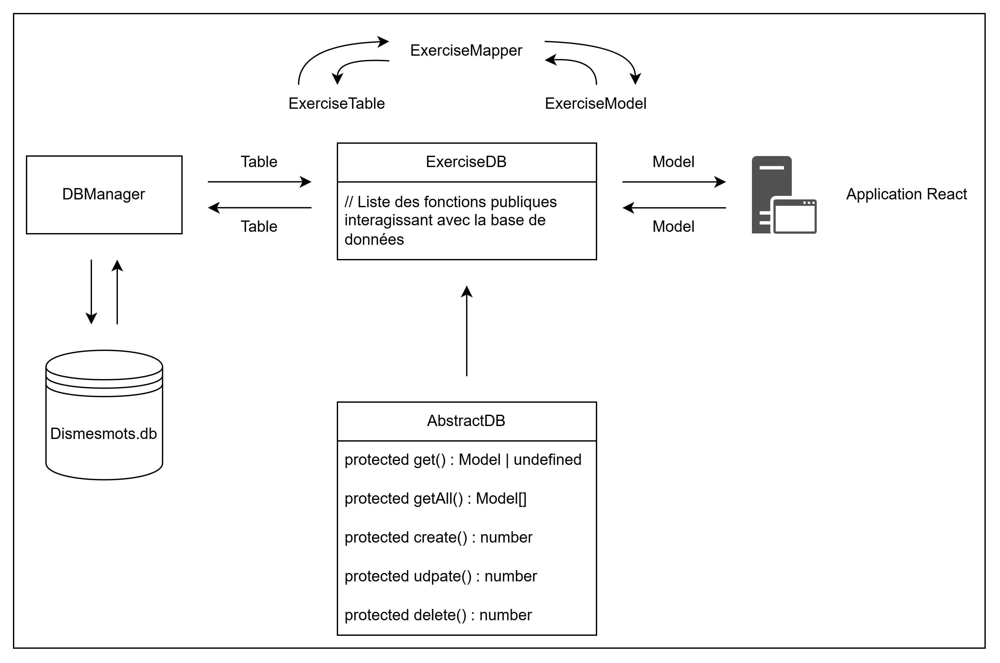

# Dossier `database`

Ce dossier regroupe toutes les fonctions utilisées pour gérer la base de données `better-sqlite3` utilisant TypeScript.

On y retrouve les dossiers :

- `db` - Contient l'ensemble des fichiers interagissant avec la base de données (requêtes SQL, lancement et arrêt de la BdD, ...) ;
- `files` - Contient les fichiers SQL utilisés lors du lancement de la base de données (requêtes pour la création, ...) ;
- `mocks` - Contient les données de test pour le développement, à utiliser pour tester des cas précis ;
- `tables` - Contient un ensemble d'interfaces représentant chacune une table de la base de données ;
- `models` (situé dans le dossier /shared) - Contient un ensemble d'interface représentant les données traitées ;
- `mappers` - Contient un ensemble de classes qui permet de passer d'une table à un modèle et d'un modèle à une table ;

```ts
`./`
|
|- `database`
|  |
|  |- `db`
|  |- `files`
|  |- `mocks`
|  |- `mappers`
|  |- `tables`
|
|- `shared`
   |
   |- `models`
```

## Structure générale

Pour chaque table ou vue de la base de données, il faut créer un fichier `Table.ts`, `Model.ts`, `Mapper.ts` et `DB.ts`.

Si la requête demande des champs précis, il est possible de créer un nouveau fichier `Model.ts` avec les champs désirés.

Sinon, si la requête est plus complexe et demande plusieurs tables, il est possible de créer une nouvelle vue en SQL (via `VIEW`) auquel cas, il faudra recréer un fichier de chaque pour la vue.

Le but ici est de bien séparer le traitement de données pour garantir l'unicité et la solidité du code.



## Redirections

- [README.md du dossier `db`](./db/README.md)
- [README.md du dossier `files`](./files/README.md)
- [README.md du dossier `mocks`](./mocks/README.md)
- [README.md du dossier `tables`](./tables/README.md)
- [README.md du dossier `models`](./../shared/models/README.md)
- [README.md du dossier `mappers`](./mappers/README.md)
- [Retour au README.md de la racine](./../README.md)

<style>
  @import "../docs/readmeDocs/assets/style.css"
</style>
