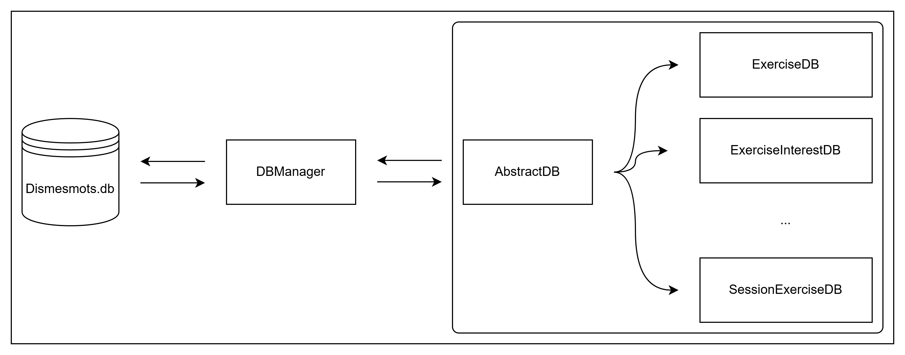

# Dossier Base de données

Ce dossier gère les interactions avec la base de données.

Chaque fichier `DB.ts` représente une table ou une vue de la base de données.

Pour chacun de ses fichiers, on décrit toutes les requêtes qu'on souhaite effectuer sur la table associée. Si on doit travailler sur plusieurs tables, on privilégie le fait de créer des fonctions dans d'autres fichiers `DB.ts` afin de conserver une bonne séparation entre les objets métiers.



## Driver et lancement des requêtes `DBManager.ts`

La classe `DBManager` est utilisée comme intermédiaire pour se connecter et fermer la connexion avec la base de données, mais aussi pour effectuer des requêtes.

Lors de la connexion, elle se connecte au fichier `dismesmots.db` situé à la racine et utilise les requêtes situés dans `database/files/startDB.sql`pour initialiser les tables ou les vues si elle n'existe pas déjà.

Dernier point, pour effectuer des requêtes, elle met à disposition les fonctions :

- `execRequest` - Exécute une requête et renvoie un objet de type `Database.RunResult` ,
- `getRequest` - Exécute une requête et renvoie un élément sous la forme d'un `Model.ts` ou d'un `undefined` (si la donnée n'est pas trouvée) ;
- `getAllRequest` - Exéctue une requête et renvoie un tableau d'objet `Model.ts` ;

Toutefois, ces fonctions sont déjà utilisées dans les fichiers `DB.ts`, détaillées plus bas. Il faut donc privilégier leurs utilisations plutôt que d'utiliser les fonctions bruts du `DBManager`.

## Fonctionnement d'un fichier `DB.ts`

Pour créer une fichier `DB.ts`, on a besoin d'un mapper, d'une table et d'un modèle.

Le mapper est utilisé automatiquement par le classe abstraire `AbstractDB.ts` pour transformer les données récupérées en modèle sans qu'on est besoin de le faire dans chaque requête.

```ts
export class PatientInterestDB extends AbstractDB<
  PatientInterestTable,
  PatientInterestModel
> {
  protected mapper: new () => AbstractMapper<
    PatientInterestTable,
    PatientInterestModel
  > = PatientInterestMapper;
}
```

## Utilisation de `AbstractDB.ts`

`AbstractDB.ts` met à disposition aux classes des outils pour interagir avec la base de données (en `protected`).

Les fonctions sont les suivantes :

- `get` - Sélectionne un seul élément de la base de données - L'élément renvoyé est soit un objet `Model.ts`, soit `undefined` si l'élément n'a pas pu être trouvé ;
- `getAll` - Sélectionne plusieurs éléments de la base de données - La fonction renvoie un tableau de `Model.ts` ;
- `create` - Ajoute une nouvelle donnée dans une table - La fonction renvoie l'identifiant de l'élément nouvellement créé ;
- `update` - Met à jour un ou plusieurs éléments d'une table - La fonction renvoie le nombre de lignes modifiées ;
- `delete` - Supprime un ou plusieurs éléments d'une table - La fonction renvoie le nombre de lignes supprimées ;

En ce qui concerne les paramètres, ils sont similiaires entre toutes les fonctions. On demande une requête SQL avec des `?`. Chaque `?` sont remplacées par les paramètres qui suivent.

Exemple :

```ts
export class PatientInterestDB extends AbstractDB<
  PatientInterestTable,
  PatientInterestModel
> {
  protected mapper: new () => AbstractMapper<
    PatientInterestTable,
    PatientInterestModel
  > = PatientInterestMapper;

  exampleFunction() {
    this.get('SELECT * FROM patient WHERE id = ?', id);
    // --> SELECT * FROM patient WHERE id = <id>

    this.getAll(
      'SELECT * FROM patient WHERE notes >= ? AND notes <= ?',
      start,
      end
    );
    // --> SELECT * FROM patient WHERE notes >= <start> AND notes <= <end>

    this.create(
      'INSERT INTO sessions (patient_id, date, status, notes) VALUES (?, ?, ?, ?)',
      patientId,
      date,
      status,
      notes
    );
    // --> INSERT INTO sessions (patient_id, date, status, notes) VALUES (<patientId>, <date>, <status>, <notes>)
  }
}
```

Contenu du fichier `AbstractDB.ts`

```ts
/**
 * Class abstract AbstractDB
 * Cette classe abstraite représente la structure générale d'un fichier de DB
 */
export abstract class AbstractDB<
  Table extends AbstractTable,
  Model extends AbstractModel,
> {
  // Instance du driver
  protected dbManager: DBManager = DBManager.getInstance();

  // Définition du mapper en abstract
  protected abstract mapper: new () => AbstractMapper<Table, Model>;

  /**
   * Récupérer une donnée de la base de données
   * @param request Requête à exécuter
   * @param params Liste des paramètres
   * @returns Renvoie un objet model correspondant au résultat
   */
  protected get<BindParameters extends unknown[]>(
    request: string,
    ...params: BindParameters
  ): Model | undefined {
    return this.dbManager.getRequest(this.mapper, request, params);
  }

  /**
   * Récupérer toutes les données de la base de données
   * @param request Requête à exécuter
   * @param params Liste des paramètres
   * @returns Renvoie un tableau d'objet correspondant au résultat
   */
  protected getAll<BindParameters extends unknown[]>(
    request: string,
    ...params: BindParameters
  ): Model[] {
    return this.dbManager.getAllRequest(this.mapper, request, params);
  }

  /**
   * Ajouter une ligne à la base de données
   * @param request Requête à exécuter
   * @param params Liste des paramètres
   * @returns Renvoie l'identifiant du nouvel objet créé
   */
  protected create<BindParameters extends unknown[]>(
    request: string,
    ...params: BindParameters
  ): number {
    const resRequest: Database.RunResult = this.dbManager.execRequest(
      request,
      ...params
    );
    return resRequest.lastInsertRowid as number;
  }

  /**
   * Modifier des données de la base de données
   * @param request Requête à exécuter
   * @param params Liste des paramètres
   * @returns Renvoie le nombre de lignes modifiées
   */
  protected update<BindParameters extends unknown[]>(
    request: string,
    ...params: BindParameters
  ): number {
    const resRequest: Database.RunResult = this.dbManager.execRequest(
      request,
      ...params
    );
    return resRequest.changes;
  }

  /**
   * Supprimer des lignes de la base de données
   * @param request Requête à exécuter
   * @param params Liste des paramètres
   * @returns Renvoie le nombre de lignes supprimées
   */
  protected delete<BindParameters extends unknown[]>(
    request: string,
    ...params: BindParameters
  ): number {
    const resRequest: Database.RunResult = this.dbManager.execRequest(
      request,
      ...params
    );
    return resRequest.changes;
  }
}
```

## Redirections

- [Retour au README.md du dossier `database`](./../README.md)
- [Retour au README.md de la racine](./../../README.md)

<style>
  @import "../../docs/readmeDocs/assets/style.css"
</style>
