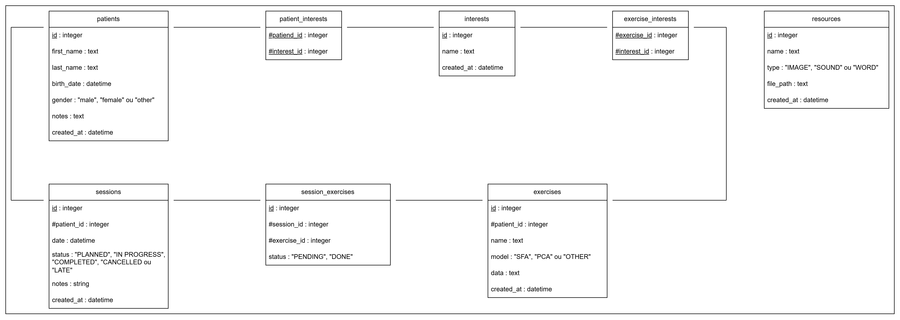

# Fichiers SQL

Ce dossier regroupe tous les fichiers SQL utile pour le lancement de l'application. Ici, on a :

- `StartDB.sql` - Regroupe toutes les commandes pour la création des tables ;
- ...

## Redirections

- [Retour au README.md du dossier `database`](./../README.md)
- [Retour au README.md de la racine](./../../README.md)

