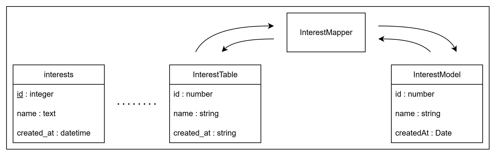

# Définition d'un mapper

Les mappers transforment les données provenant des `Table.ts` en `Model.ts`. Le but de ces fichiers est de pouvoir effectuer des traitements sur les données dès leur appel depuis la base de données.

Chaque fichier mapper représente une table ou une vue de la base de données.

Petite exception pour les données complexes (json stringifié, ...) où on crée un mapper à part pour séparer les traitements (ex : `AbstractExerciseMapper.ts`, `SFAExerciseMapper.ts`, ...).

Par exemple :



```sql
CREATE TABLE IF NOT EXISTS interests (
    id INTEGER PRIMARY KEY AUTOINCREMENT,
    name TEXT NOT NULL UNIQUE,
    created_at DATETIME DEFAULT CURRENT_TIMESTAMP
);
```

```ts
export interface InterestTable extends AbstractTable {
  id: number;
  name: string;
  created_at: string;
}
```

```ts
export interface InterestModel extends AbstractModel {
  id: number;
  name: string;
  createdAt: string;
}
```

```ts
export class InterestMapper extends AbstractMapper<
  InterestTable,
  InterestModel
> {
  public mapTableToModel(table: InterestTable): InterestModel {
    return {
      id: table.id,
      name: table.name,
      createdAt: table.created_at,
    };
  }

  public mapModelToTable(model: InterestModel): InterestTable {
    return {
      id: model.id,
      name: model.name,
      created_at: model.createdAt,
    };
  }
}
```

## Redirections

- [Retour au README.md du dossier `database`](./../README.md)
- [Retour au README.md de la racine](./../../README.md)

<style>
  @import "../../docs/readmeDocs/assets/style.css"
</style>
