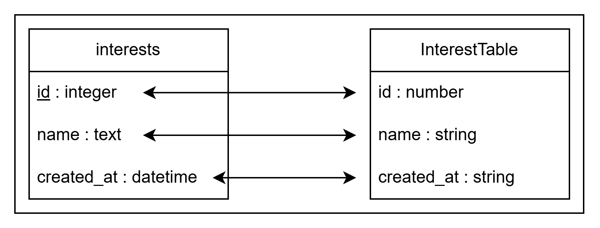

# Définition d'une table

Chaque table représente une table ou une vue de la base de données.

Avant le mapping des données en modèles, lorsque dans `DBManager.ts`, 'on récupère des données via un `.get()` ou `.all()`, les données prennent le type de la table indiquée.

Pour que cette méthode fonctionne, Il faut que les données renvoyées (autant leur type que leur nom) correspondent précisément à l'objet `Table.ts` associé.

Par exemple :



```sql
CREATE TABLE IF NOT EXISTS interests (
    id INTEGER PRIMARY KEY AUTOINCREMENT,
    name TEXT NOT NULL UNIQUE,
    created_at DATETIME DEFAULT CURRENT_TIMESTAMP
);
```

```ts
export interface InterestTable extends AbstractTable {
  id: number;
  name: string;
  created_at: string;
}
```

## À savoir pour le typage

| Type SQL                                                                                                                | Type Typescript |
| ----------------------------------------------------------------------------------------------------------------------- | --------------- |
| tinyint, smallint, mediumint, int, bigint, decimal, float, double, real, bit, integer, boolean, serial                  | number          |
| date, datetime, timestamp, time, year                                                                                   | string          |
| chat, varchar, tinytext, text, mediumtext, longtext, binary, varbinary, tinyblob, blob, mediumblob, longblob, enum, set | string          |
| null                                                                                                                    | null            |

Pour `better-sqlite3`, les dates sont renvoyées comme étant des strings et ne sont pas transformées automatiquement en objet Date.

Dans le cas, où on définit un ensemble fini de valeur comme :

```sql
gender TEXT CHECK(gender IN ('male', 'female', 'other')) NOT NULL,
```

Il est possible d'appliquer directement un type qui reprend les valeurs :

```ts
export type PatientGender = 'male' | 'female' | 'other';
```

On a fait le choix de ne pas utiliser le type `json`, car le mapping des date n'étant pas complet, on ne sait pas s'il est pris en charge par `better-sqlite3`. (ça peut être une piste d'amélioration pour les données complexes).

## Conseil

Si les requêtes pour récupérer des données deviennent trop complexe, ne pas hésiter à créer des VIEW dans la base de données.

Par exemple :

```sql
CREATE VIEW IF NOT EXISTS exampleview AS
SELECT p.id as "id", first_name, last_name, date
FROM patient p, session s
WHERE s.patient_id = p.id
```

```ts
export interface ExampleTable extends AbstractTable {
  id: number;
  first_name: string;
  last_name: string;
  date: string;
}
```

## Redirections

- [Retour au README.md du dossier `database`](./../README.md)
- [Retour au README.md de la racine](./../../README.md)

<style>
  @import "../../docs/readmeDocs/assets/style.css"
</style>
