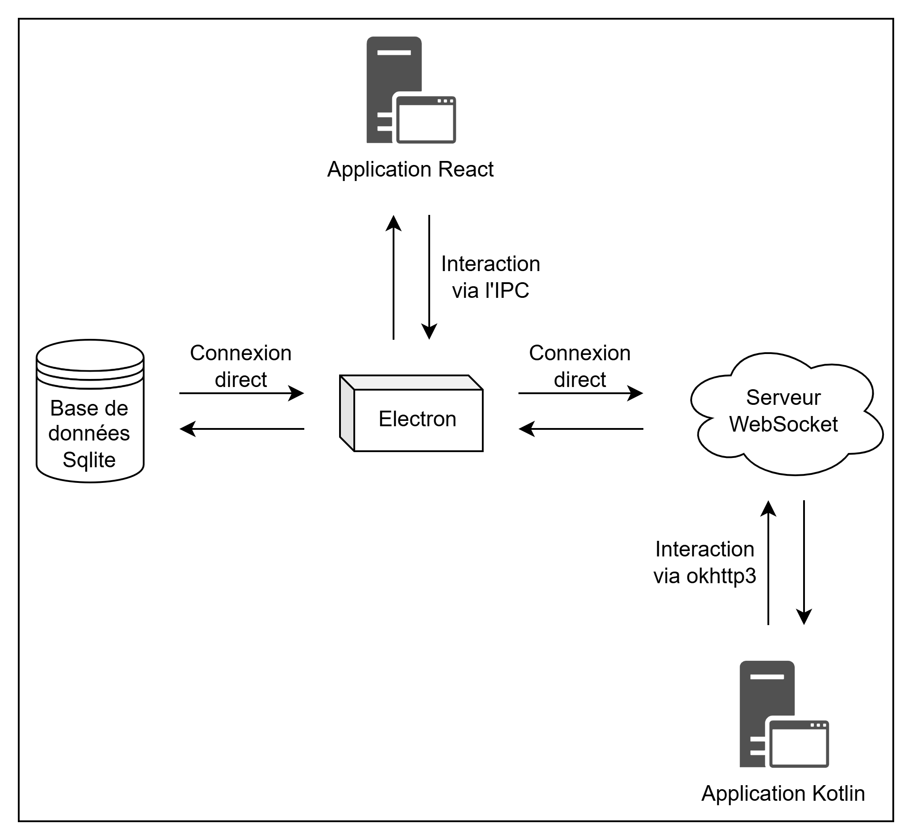
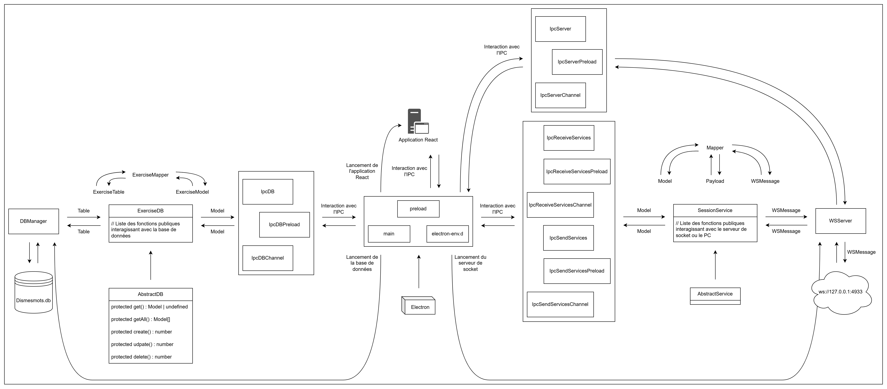

# Electron

Ce dossier correspond au début de l'application. C'est ici que tous les services sont démarrés (Base de données, serveur de socket et génération de l'application) et qu'on permet les interactions entre les parties.

L'IPC ou Inter-Process Communication est un outils qui permet de faire interagir les services Electron entre eux. Ici, on l'utilise pour que les services utilisées au niveau du serveur electron, du serveur de socket, et de la base de données, soient utilisable depuis l'application React.

Ci-dessous un schéma simplifié sur le fonctionnement de l'application :

Et ci-dessous un second schéma, mais en plus détaillé :

## Redirections

- [README.md du dossier `utils`](./utils/README.md)
- [Retour au README.md de la racine](./../README.md)

