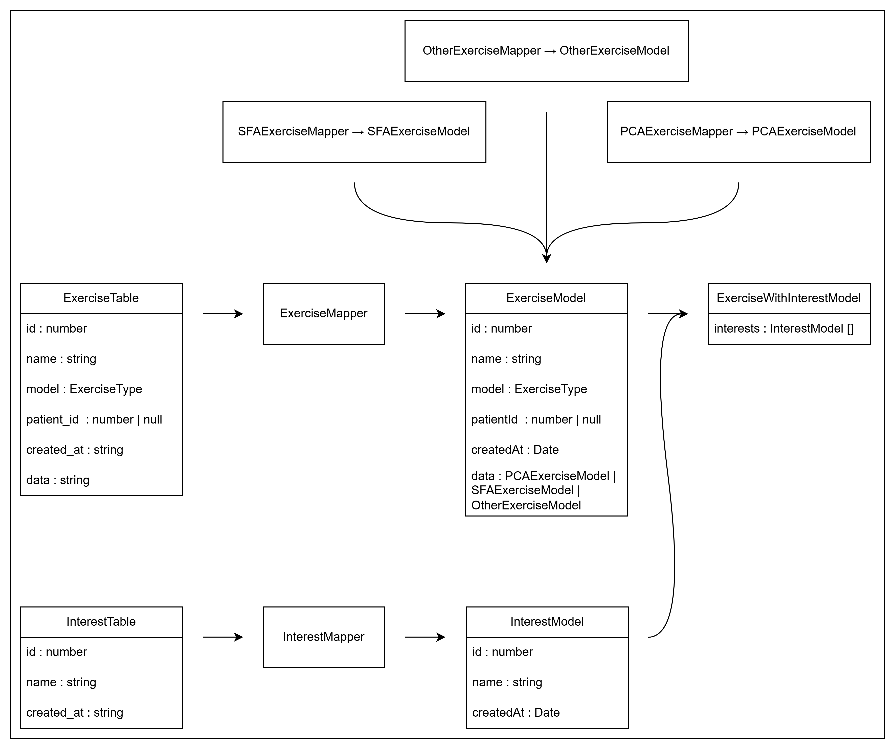

# Liste des modèles

## Informations générales

Chaque modèle représente une table, une vue, une interaction avec le serveur de socket ou une structure complexe (combinaison de plusieurs tables, ...).

Les modèles sont :

- Le résultat du mappage des données requêtées provenant de la base de données ;
- Le résultat du mappage des données reçues depuis le serveur de socket ;
- Des données à envoyer à la base de données ou au serveur de socket ;

Leur but est de définir une structure aux données en appliquant des types précis et de certifier l'existance des clés qui le composent.

Par exemple :



Données provenant de la base de données sur la forme de tables (`Table.ts`).

```ts
export interface ExerciseTable extends AbstractTable {
  id: number;
  name: string;
  model: ExerciseType;
  patient_id: number | null;
  created_at: string;
  data: string;
}
```

Données mappées et traitées sous la forme de modèles (`Model.ts`).

```ts
export interface ExerciseModel extends AbstractModel {
  id: number;
  name: string;
  model: ExerciseType;
  patientId: number | null;
  createdAt: Date;
  data: PCAExerciseModel | SFAExerciseModel | OtherExerciseModel;
}
```

```ts
export interface SFAExerciseModel extends AbstractModel {
  sfaCategory: string;
  sfaUse: string;
  sfaAction: string;
  sfaProperties: string;
  sfaAssociation: string;
}
```

```ts
export interface PCAExerciseModel extends AbstractModel {}
```

```ts
export interface OtherExerciseModel extends AbstractModel {}
```

Extension du modèle pour receuillir les centres d'intérêts.

```ts
export interface ExerciseWithInterestsModel extends ExerciseModel {
  interests: InterestModel[];
}
```

## Redirections

- [Retour au README.md du dossier `shared`](./../README.md)
- [Retour au README.md du dossier `database`](./../../database/README.md)
- [Retour au README.md du dossier `wsserver`](./../../wsserver/README.md)
- [Retour au README.md de la racine](./../../README.md)

<style>
  @import "../../docs/readmeDocs/assets/style.css"
</style>
