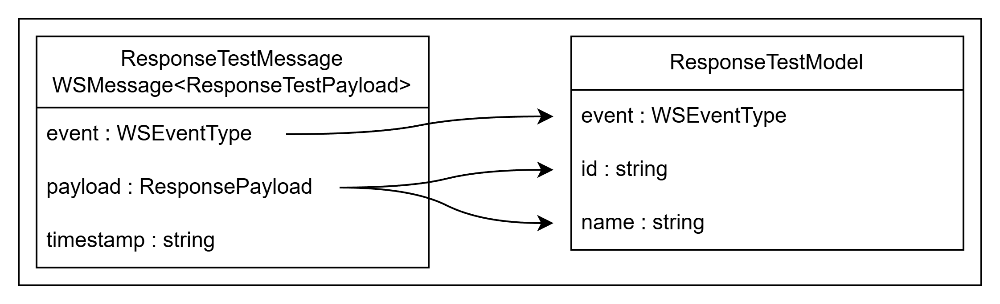

# Liste des mappers

Dans ce dossier, on répertorie tous les mappers qui permettent de passer d'un modèle à un message et d'un message à un modèle.

On a décidé de diviser le mapper en 2 parties `toMessage` et `toModel`, car les données envoyées et les données reçues en rarement la même structure lorsqu'on interagir avec un serveur de socket.

En effet, lorsqu'on passe d'un message à un modèle et inversement, on sélectionne les données à envoyer. En d'autres termes, les données non-utilisées sont ignorées pour limiter la taille des messages, ce qui empêche de pouvoir passer d'un état à un autre.

## Les mappers `toMessage`

Tout d'abord, il faut savoir qu'un message standard est composé d'un évènement (`"event"`), une date d'envoie (`"timestamp"`) et de données (`"payload"`).

Le payload est important, car c'est lui qui stocke les données du modèle à envoyer au serveur de socket.


Un mapper se divise donc en deux parties :

- Tout d'abord, on mappe les données de modèles vers payload pour sélectionner les informations qui nous intéressent à envoyer au serveur ;
- Enfin, on incorpore les données du payload dans un message standardiser prêt à l'envoie ;

```ts
export class ExerciseResponseMapperToMessage extends AbstractMapperToMessage<
  ExerciseResponseMessage,
  ResponsePayload,
  ResponseExerciseModel
> {
  public mapModelToPayload(model: ResponseExerciseModel): ResponsePayload {
    return <ResponsePayload>{
      exercise_id: model.exercise.id,
      field_type: model.fieldType,
      value: model.value,
    };
  }

  public mapPayloadToMessage(
    payload: ResponsePayload
  ): ExerciseResponseMessage {
    return <ExerciseResponseMessage>{
      event: 'EXERCISE_RESPONSE',
      payload: payload,
      timestamp: new Date().toISOString(),
    };
  }
}
```

## Les mappers `toModel`

De ce point de vue ci, le programme récupère un message reçu depuis le serveur qu'il souhaite transformer en modèle afin de le renvoyer à l'application React.

Pour cela, le mapper ne dispose que d'une seule fonction qui sélectionne les données utiles pour les reporter dans un modèle.



Pour le moment, aucun mapper `toModel` n'a encore été créé, donc voici un exemple utilisant la classe Abstraite

```ts
class TestModel extends AbstractMapperToModel<
  ResponseTestMessage,
  ResponseTestPayload,
  ResponseTestModel
> {
  public mapMessageToModel(message: ResponseTestMessage): ResponseTestModel {
    return <ResponseTestModel> {
        id: message.payload.id,
        name: message.payload.name
        event: message.event
    }
  }
}
```

## Redirections

- [Retour au README.md du dossier `wsserver`](./../README.md)
- [Retour au README.md de la racine](./../../README.md)

<style>
  @import "../../docs/readmeDocs/assets/style.css"
</style>
