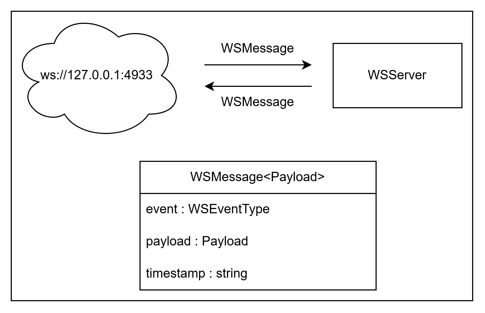

# Les messages utilisés par le serveur WebSocket

Pour chacune des interactions avec le serveur webSocket, nous avons décidé de normaliser la structure générale d'une donnée avec `WSMessage.ts`.

Il faut savoir qu'un message standard est composé d'un évènement (`"event"`), une date d'envoie (`"timestamp"`) et de données (`"payload"`).



```ts
/**
 * Structure de base d'un message WebSocket
 * Tous les messages doivent suivre cette structure
 */
export interface WSMessage<Payload extends AbstractPayload> {
  event: WSEventType;
  payload: Payload;
  timestamp: string;
}
```

## Créer un nouveau message

Le payload est une interface qui regroupes les données à envoyer au serveur. C'est une interface métier qui récupère des données à partir de modèles reçus depuis l'application.

Afin de créer un nouveau message, il suffit de définir un payload et de créer un type message qui étend WSMessage.

```ts
export type TabletConnectedMessage = WSMessage<TabletConnectionPayload>;
```

```ts
export interface TabletConnectionPayload extends AbstractPayload {
  device_id?: string;
  device_name?: string;
}
```

On privilégie le fait de créer un type plutôt qu'une interface, afin de garder une structure générale similaire entre les tous les messages, et ainsi, ne permettre de modifier que le Payload.

Inversement, utiliser une interface aurait permis d'ajouter des clés supplémentaires à WSMessage et ce n'est pas le but recherché ici

```ts
// À éviter
export interface TableConnectedMessage extends WSMessage<TabletConnectionPayload> {
  // Nouvelles clés
}
```

## Redirections

- [Retour au README.md du dossier `wsserver`](./../README.md)
- [Retour au README.md de la racine](./../../README.md)

<style>
  @import "../../docs/readmeDocs/assets/style.css"
</style>
