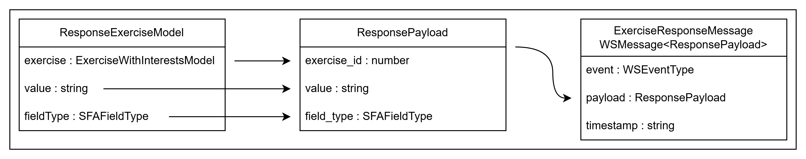

# Définition d'un payload

Le payload est une interface qui regroupes les données à envoyer au serveur. C'est une interface métier qui récupère des données à partir de modèles reçus depuis l'application.

Il compose également les messages qui sont envoyés au serveur de socket. Ils représentent la partie métier de ces messages.



```ts
export interface ResponseExerciseModel extends AbstractModel {
  exercise: ExerciseWithInterestsModel;
  value: string;
  fieldType: SFAFieldType;
}
```

```ts
export interface ResponsePayload extends AbstractPayload {
  exercise_id: number;
  field_type: SFAFieldType;
  value: string;
}
```

```ts
export type ExerciseResponseMessage = WSMessage<ResponsePayload>;
```

## Redirections

- [Retour au README.md du dossier `wsserver`](./../README.md)
- [Retour au README.md de la racine](./../../README.md)

<style>
  @import "../../docs/readmeDocs/assets/style.css"
</style>
