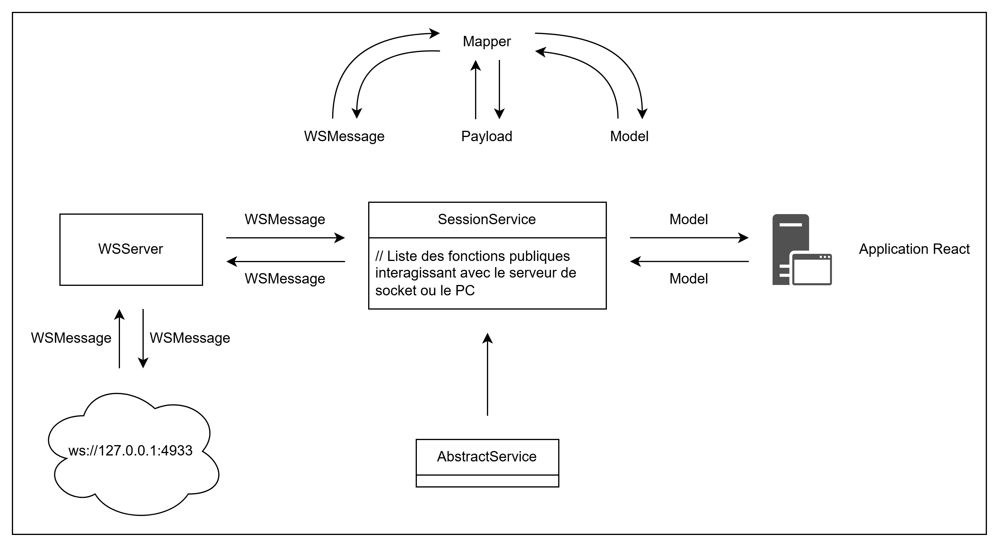

# Les services

Un service définit un ensemble d'action interagissant avec le serveur de socket (`Server -> PC` et `PC -> Server`).



Comme pour la base de données, on privilégie le fait de répartir les services en fonction de leur utilité. Actuellement, on dispose que d'un seul service `SessionService.ts` qui gère les interactions durant une séance avec l'orthophoniste. Plus précisément, les interactions concernant l'exercice (lancement, vérification, validation, ...).

Si vous souhaitez créer des services où doivent être stockées dynamiquement dans le service, alors il est rcommandé de prilégier l'utiliisation d'un singleton.

```ts
export class SessionService extends AbstractService {
  // --- VARIABLES ---

  private currentExercise: ExerciseWithInterestsModel | null = null;
  private static instance: SessionService | null = null;

  // --- SINGLETON ---

  private constructor() {
    super();
  }

  public static getInstance(): SessionService {
    if (SessionService.instance === null) {
      SessionService.instance = new SessionService();
    }
    return SessionService.instance;
  }

  // --- LANCEMENT D'UN EXERCICE ---

  // PC -> Server
  public startExercise(exercise: ExerciseWithInterestsModel): void {
    ...

    LogsManager.logInfo(`L'orthophoniste souhaite lancer l'exercice : ${exercise.name}`);

    const wsServer = WSServer.getInstance();
    wsServer.broadcastWSMessage(message);
  }

  // --- VÉRIFICATION DES CHAMPS ---

  // Server -> PC
  public processPatientResponse(
    response: ResponsePayload
  ): ExpectedResponseModel {
    ...

    const value: string | null = this.getExpectedValue(response.field_type);
    LogsManager.logInfo(`Le patient a sélectionné : ${response.field_type}. Réponse attendue est : "${value}"`);

    return <ExpectedResponseModel>{ expectedValue: value };
  }

  // --- VALIDATION DE L'ORTHOPHONISTE ---

  // PC -> Server
  public sendManualResult(resultModel: ResultModel): void {
    ...

    LogsManager.logInfo(`L'orthophoniste a sélectionné : ${resultModel.fieldType}. La réponse a été considérée comme ${resultModel.correct ? "correct" : "incorrect"} (${resultModel.correct})`);

    const wsServer = WSServer.getInstance();
    wsServer.broadcastWSMessage(message);
  }

  public clearCurrentExercise(): void {
    LogsManager.logInfo("Suppression de l'exercice courant");
    this.currentExercise = null;
  }
}
```

## Redirections

- [Retour au README.md du dossier `wsserver`](./../README.md)
- [Retour au README.md de la racine](./../../README.md)

<style>
  @import "../../docs/readmeDocs/assets/style.css"
</style>
