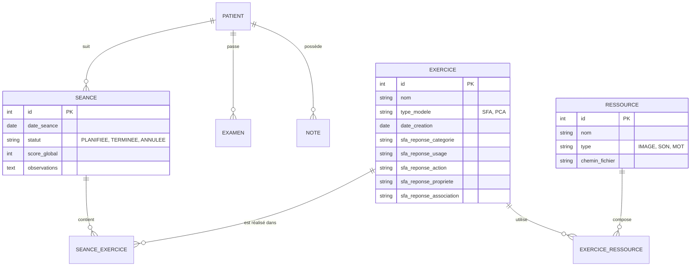
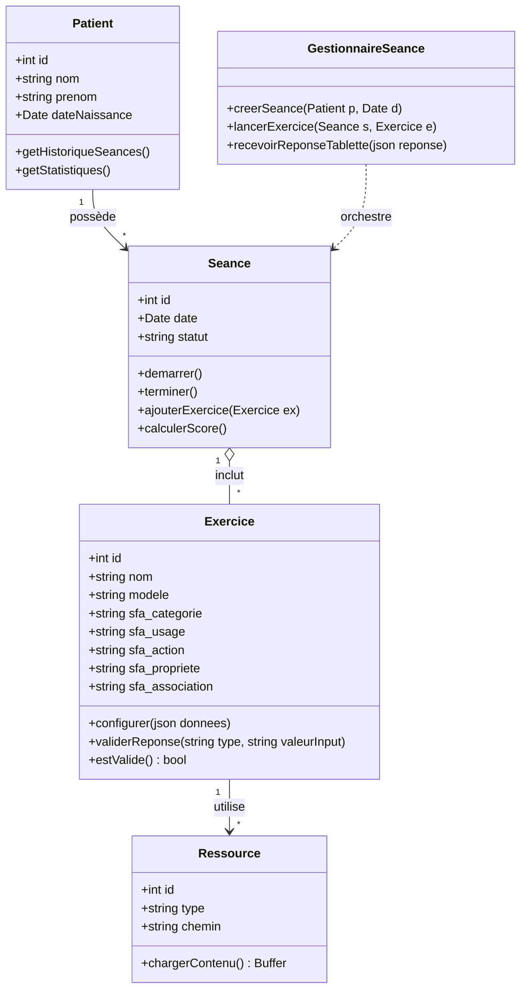

# Rapport de Conception Backend et Base de Données - Projet "DisMesMots"

## 1. Vue d'ensemble de l'Architecture

Le projet repose sur une architecture hybride **Desktop (Orthophoniste)** et **Tablette (Patient)**, communiquant en temps réel via un réseau local.

### Composants Principaux
*   **Serveur Local (Backend)** : Intégré directement dans l'application Electron (PC). Il agit comme le cerveau du système.
    *   *Technologie* : Node.js (intégré à Electron).
    *   *Rôle* : Gestion des données, hébergement du serveur WebSocket, accès au système de fichiers.
*   **Base de Données** : Locale et embarquée.
    *   *Technologie* : **SQLite**.
    *   *Justification* : Idéal pour une application monoposte (pas d'installation de serveur externe requise), garantie de confidentialité des données patient (tout reste sur la machine de l'orthophoniste), et supporte parfaitement le mode hors ligne.
*   **Communication Temps Réel** :
    *   *Protocole* : **WebSocket**.
    *   *Flux* : Le PC (Serveur) envoie les exercices à la Tablette (Client). La Tablette renvoie les actions et réponses du patient instantanément.

---

## 2. Conception de la Base de Données (MCD/ERD)

La base de données est structurée autour du **Patient** et de son parcours de soin (**Séances**).

### Diagramme Entité-Relation

### Points Clés
1.  **Centralisation de l'Exercice** : Contrairement à une approche modulaire complexe, nous avons choisi d'intégrer les champs de configuration SFA (Semantic Feature Analysis) directement dans la table `Exercice`. Cela simplifie grandement les requêtes et la maintenance pour le périmètre actuel.
2.  **Gestion des Ressources** : Les images et sons sont découplés des exercices. Une même image (ex: "Pomme") peut être utilisée dans plusieurs exercices différents (SFA, Dénomination, etc.).

---

## 3. Diagramme de Classes (Architecture Logicielle)

Ce diagramme représente la structure des objets manipulés par le backend. Il met en évidence la logique métier.

---

## 4. Décisions de Conception & Recommandations

### Pourquoi fusionner la configuration dans la classe `Exercice` ?
**Décision** : Fusionner les attributs spécifiques au SFA (catégorie, usage, action...) directement dans l'entité `Exercice` plutôt que de créer une classe `ConfigurationSFA` séparée.

**Justification Technique & Métier** :
1.  **Simplicité (KISS)** : L'application gère actuellement un nombre limité de types d'exercices (principalement SFA et PCA). Créer une structure d'héritage complexe ou des tables de jointure pour la configuration ajouterait une charge cognitive et technique inutile (Over-engineering).
2.  **Facilité d'interrogation** : Pour afficher un exercice, une seule requête SQL suffit (`SELECT * FROM Exercice`). Pas de jointures multiples couteuses.
3.  **Flexibilité immédiate** : Si un exercice est de type "PCA", les champs SFA restent simplement à `null`. C'est un compromis acceptable pour gagner en rapidité de développement.

### Recommandations pour le Backend
1.  **Librairie Database** : Utiliser **better-sqlite3**.
    *   C'est la librairie utilisée dans la branche `mvp-v0`.
    *   Elle offre des performances excellentes (synchrone) et une API simple (`prepare/run`).
2.  **Architecture "Service/Repository"** :
    *   `db.ts` : Initialisation de la connexion et des tables.
    *   `Repositories` : Classes contenant le SQL brut (ex: `SELECT * FROM patients`).
    *   `Services` : Logique métier appelant les repositories.

### Flux Métier Type (Scénario)
1.  **Préparation** : L'orthophoniste crée une séance pour "M. Dupont". Il sélectionne 3 exercices SFA existants.
2.  **Connexion** : L'orthophoniste lance la séance. Le serveur WebSocket s'active. La tablette scanne le QR Code et se connecte.
3.  **Jeu** : Le `GestionnaireSeance` envoie le premier exercice (JSON) à la tablette.
4.  **Interaction** : Le patient touche "C'est un fruit". La tablette envoie `{ event: "REPONSE", type: "CATEGORIE", valeur: "fruit" }`.
5.  **Validation** : La classe `Exercice` compare la valeur reçue avec son attribut `sfa_categorie`. Si correct, le `GestionnaireSeance` met à jour le score et notifie la tablette ("Bravo").
